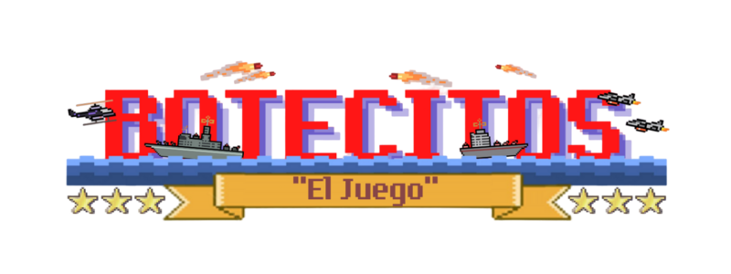

#### Botecitos_El_Juego
<h1 align="center">BOTECITOS: "El Juego"</h1>

   

     
   

## Índice

*[Insignias](#insignias)

*[Descripción del proyecto](#Descripcion-del-proyecto)

*[Estado del proyecto](#Estado-del-proyecto)

*[Acceso al proyecto](#acceso-proyecto)

*[Tecnologías utilizadas](#tecnologías-utilizadas)

*[Personas-Desarrolladores del Proyecto](#personas-desarrolladores)

## Descripción del proyecto

BOTECITOS: "El juego", es un juego de botecitos basado en el clásico juego de mesa Battleship que es el clásico juego de combate naval que combina competitividad, estrategia y emoción.

BOTECITOS (el videojogo) te introduce en una batalla cara a cara y puede jugase tanto multijugador entre dos jugadores al igual que en el singleplayer entre un jugador y la máquina, donde tratan de ubicar la flota enemiga y destruir sus naves una a una un disparo a la vez.

El juego BOTECITOS, pone a sus jugadores justo en medio de la acción, donde pueden comandar una poderosa flota que incluye un portaaviones, un destructor, un submarino, un bote patrulla y un acorazado.

Cada jugador escribe las coordenadas donde irán las balas de cada ataque esperando averle acertado a una flota enemiga.

Anímate a jugar BOTECITOS the game y coloca tus naves muy estratégicamente para poder sobrevivir a los ataques incesantes de tu adversario a la vez que lanzas tus ataques con aciertos y fallos en el tablero de cuadrícula oceánica.

¡Ni una sola flota estará a salvo en este increible e inmersivo juego de sigilo, suspenso y estrategia!, esto es BOTECITOS: "El Juego".

<h4 align="center">
:construction: Proyecto en construcción :construction:
</h4>

## :hammer:Formas de juego
- `PVE`: El método de juego singleplayer PVE o Player versus Enviroment (Jugador contra Entorno), en el que si no cuentas con ningun amigo o vida social alguna, puedes jugar solo contra una máquina programada.
- `PVP`: El método de juego multiplayer PVP o Player Versus Player (Jugador contra jugador), en el que juegas con tus amigos :D.

\## 📁 Acceso al proyecto
Descarga el proyecto

\## 🛠️ Abre y ejecuta el proyecto
Ejecuar init.sh (si no tienes acceso a una terminal Bash, ejecuta program_init.py)

#:ok:Tecnologías utilizadas
- Python
- Pygame
- Bash
- Microsoft Teams

## Autores

| [ -Abel Avendaño-](https://github.com/AbelAvendanoArgueta) |  [ -RidiConHuracanes-](https://github.com/RidiConHuracanes) | [ -Misa González-](https://github.com/ElMisaaa) |  
| :---: | :---: | :---: |